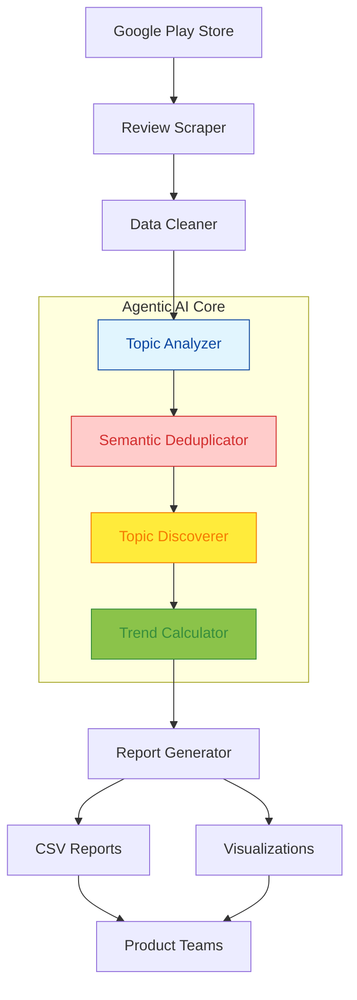

# AI Agent - Play Store Review Analysis

## 📋 Overview

PulseGen is an advanced AI-powered system designed to analyze Google Play Store reviews and generate insightful trend analysis reports for product teams. The tool leverages state-of-the-art NLP models, such as BERT and Sentence Transformers, to identify key themes, track feedback over time, and provide actionable insights without requiring any external API keys. 

This open-source solution focuses on streamlining the review analysis process with minimal configuration, while offering high flexibility and adaptability to evolving product feedback.

## 🎯 Features

- **📊 Daily Batch Processing:** Automatically processes new reviews every day, ensuring up-to-date insights.
- **🤖 Agentic AI Topic Analysis:** Uses semantic understanding with Sentence Transformers to analyze the underlying meaning of reviews.
- **📈 30-Day Trend Analysis:** Monitors trends in review data over a rolling 30-day period, helping teams track shifts in sentiment or common issues.
- **🔄 Automatic Topic Discovery:** Identifies new and evolving topics from reviews, providing dynamic insights into user needs and feedback.
- **🔍 Semantic Deduplication:** Consolidates similar feedback topics to reduce noise and improve clarity in trend analysis.
- **📁 CSV Report Generation:** Generates professional CSV reports that summarize topics, sentiments, and trends for easy distribution to product teams.
- **🖼️ Visualization:** Visualizes key trends and feedback in interactive charts and graphs, enhancing report accessibility.
- **🔒 No API Dependencies:** Fully open-source implementation with no external API keys required, preserving privacy and flexibility.

## 🏗️ System Architecture

The PulseGen AI Agent utilizes the following components:

1. **Data Collection:** 
   - Scrapes Play Store reviews for a specific app or set of apps.
   - Data is gathered in batches on a daily schedule.

2. **Preprocessing:**
   - Tokenization and text normalization via SpaCy and custom scripts to clean the raw review text.
   - Sentence-level segmentation to prepare reviews for topic analysis.

3. **Topic Analysis:**
   - Utilizes Sentence Transformers to understand the semantic meaning of the reviews.
   - Topics are discovered by clustering similar reviews and extracting key themes.

4. **Trend Analysis:**
   - Analysis is done over a rolling 30-day window to track shifts in review sentiment, keywords, and issues.
   - Time series analysis to visualize trends and emerging issues.

5. **Report Generation:**
   - Automated generation of CSV files containing insights and statistics.
   - Interactive visualizations (e.g., trends over time) for easier interpretation by product teams.

6. **Deployment:**
   - A straightforward Python-based pipeline, entirely open-source with no external dependencies or API keys.
